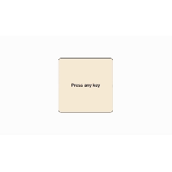

# Key Press Detector

Este é um projeto simples em JavaScript que detecta a tecla pressionada no teclado e exibe o código da tecla e o nome da tecla na tela. Quando uma tecla é pressionada, o código correspondente e a tecla são destacados em vermelho com uma borda quadrada.

## Funcionalidades

- Detecta qualquer tecla pressionada no teclado.
- Exibe o código e o nome da tecla.
- Destaque estilizado da tecla pressionada com uma borda vermelha.

## Demonstração em GIF




## Tecnologias Utilizadas

- **HTML**: Estrutura básica da página.
- **CSS**: Estilos para a página e o destaque das teclas.
- **JavaScript**: Lógica para detectar e exibir o código e o nome da tecla.


## Como Executar o Projeto

1. Clone este repositório:
   ```bash
   git clone https://github.com/ElismarSilva/key_press_detector
